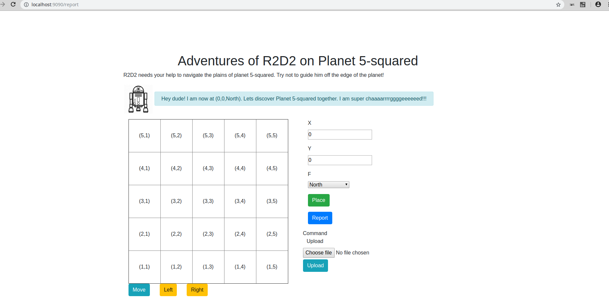

# Adventures of R2D2 on Planet 5-squared
This is a simple MVC styled PHP application built simulare a robot (ie. R2D2) moving on a 5x5 square planet.

## Tools Used
- Docker
    - Containerized the application
    - Docker images used: `php:fpm-alpine` and `nginx:alpine`
- PHP 7.3
- Composer -> Dependency handler
- PHPUnit -> Running tests

# Docker Up!
As per all my projects. I truly love the power of containerized apps. And Docker gets the job done for me always. Here is a technique is use for most of my projects.

Steps:
- Since I am using `nginx`, I always like to make sure the my `nginx.conf` file is present in the `build\nginx.conf` directory path.
- `$ docker-compose up` in a terminal. You can use `-d` to detach the ouput, or open a new `screen` terminal if in Linux. (Not a Windows guys so you'd have to figure that one out for yourself)
- Composer Install:
    - Enter `php` docker container and run the following command: `apk --no-cache add make libzip-dev && docker-php-ext-install zip`. 
        - `make` was used to run the `initialize` function in the `Makefile`. ie. `make initialize` --- This installed `composer` globally on the php docker container and also allowed composer to install `phpunit/phpunit --dev`
        - `zip` ---  Handy dependency if you decide to use Laravel with this setup. ie. I chose the long road to build an MVC from scratch so didn't really need it. Nothing to do here.
        - Now run the `composer install` command to populate the project deps.

- And that's it. Got to `http://localhost:9090` to access the `Adventures of R2D2 on Planet 5-squared` PHP application. And Enjoy!

# Tests
## Automated Testing with PHPUnit
To run the test cases, login into the `php` docker container via `docker exec -it php sh`, and run `./vendor/bin/phpunit` in the parent directory, ie. `/var/www/html`. If done correctly, you should see the following output:
```
PHPUnit 8.2.4 by Sebastian Bergmann and contributors.

Runtime:       PHP 7.3.6
Configuration: /var/www/html/phpunit.xml

...                                                                 3 / 3 (100%)

Time: 33 ms, Memory: 4.00 MB

OK (3 tests, 6 assertions)
```

Note: There are three tests with a total of 6 assertions. All of them should pass.

## Testing the Application
Now Go through the application and test out the functionality there.

Here is a list of functionality to test:
- `Place` - Enter your coordinates and hit the `Place` button to see `R2D2` glide across Planet 5-squared.
- `Report` - Hit the report button to have `R2D2` tell you his coordinates.
- Experiment further with `Move`, `Left` and `Right` to see `R2D2` explore the dimensions of the planet. `NOTE:` Giving your friendly robot out-of-range coordinates, will see him fall off the planet. Its a square after all. :)
- There's also `3` files in the `files/` directory containing three test cases that you can test via the `Upload` functionality:
    - `test1.txt` --> the output should see `R2D2` move to `(2,4,North)`.
    - `test2.txt` --> will see `R2D2` fall off the planet! He should say: `Hey dude! I am now at (0,0,West). Lets discover Planet 5-squared together. I am super chaaaarrrrggggeeeeeed!!!`
    - `test3.txt` --> will see `R2D1` again fall out of the planet at: `Hey dude! I am now at (1,0,North)`.

Let the journey begin!

